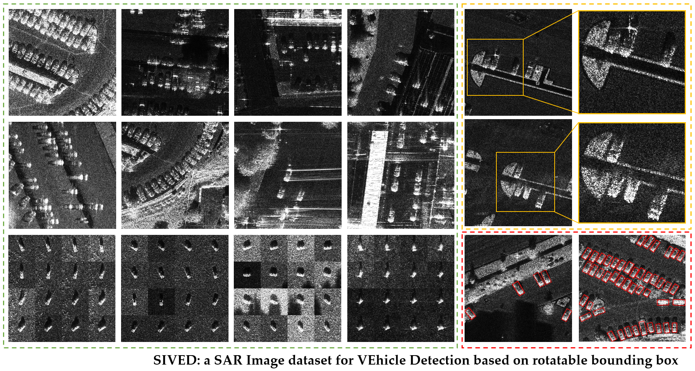

# SIVED: a SAR Image dataset for VEhicle Detection

## Introduction
SIVED is a SAR image dataset for vehicle detection using Ka, Ku, and X bands of data. Rotatable bounding box annotations were employed to improve positioning accuracy.
## Baic Information
- **Raw Data**

   |Data|Source|Band|Polarization|Resolution|
   | --- | --- | --- | --- | --- |
   |FARAD|Sandia National Laboratory|Ka/X|VV/HH|0.1m×0.1m|
   |MiniSAR|Sandia National Laboratory|Ku|-|0.1m×0.1m|
   |MSTAR|U.S. Air Force|X|HH|0.3m×0.3m|

- **Statistics**  

   |  |Scene|Train|Valid|Test|Total|  |
   | --- | --- | --- | --- | --- | --- | --- |
   | number of chips |urban|578|72|71|721|1044|
   |   |MSTAR|259|32|32|323| |
   | number of vehicles |urban|5417|710|718|6845|12013|
   |   |MSTAR|4144|512|512|5168| |

- **Annotation**  

   XML (reference PASCAL VOC) and TXT (reference DOTA)

- **File Structure** 

  
  
  ## Cite
If you feel the dataset is useful, please cite as the following format.

@Article{rs15112825,

AUTHOR = {Lin, Xin and Zhang, Bo and Wu, Fan and Wang, Chao and Yang, Yali and Chen, Huiqin},

TITLE = {SIVED: A SAR Image Dataset for Vehicle Detection Based on Rotatable Bounding Box},

JOURNAL = {Remote Sensing},

VOLUME = {15},

YEAR = {2023},

NUMBER = {11},

ARTICLE-NUMBER = {2825},

URL = { https://www.mdpi.com/2072-4292/15/11/2825 },

ISSN = {2072-4292},

DOI = {10.3390/rs15112825}

}
